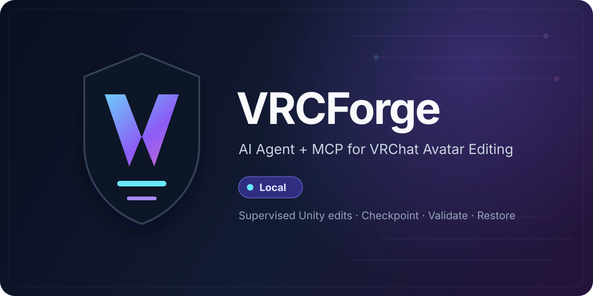

<div align="center">



[](https://github.com/ayyitong888/VRCForge/releases/latest)

[](LICENSE)

[](https://github.com/ayyitong888/VRCForge/stargazers)

**简体中文** · [English](README.en.md)

</div>

# VRCForge：用 AI Agent + MCP 辅助 VRChat Avatar 改模

VRCForge 是面向 VRChat（VRC）Avatar 创作者的开源改模工具，结合本地 AI Agent、
Unity Editor 工具与 MCP Server，辅助捏脸、换装、材质调整和优化诊断。
**AI-assisted VRChat avatar editor · Unity MCP tools · アバター改変支援**

它把桌面 Agent、FastAPI 本地运行时和 Unity Editor 工具连接到同一条受监督流程中，
用于检查模型、制定修改方案、申请执行、验证结果和恢复改动。

你可以用自然语言讨论脸型与 BlendShape、材质和 Shader、衣柜与服装、模型组合、
性能优化等任务；VRCForge 会把 Agent 的意图转换为可审查的 Unity 操作。涉及资产写入时，
流程会显示审批，并配合检查点、读回验证和恢复能力。具体 Avatar、依赖和 Unity 环境仍需逐项验证。

> 使用任何会写入 Unity 资产的功能前，请先备份 Unity / VRChat Avatar 工程。

本页对应已发布的 [v1.8.0 稳定版](https://github.com/ayyitong888/VRCForge/releases/tag/v1.8.0)。
安装与升级请获取同一 Release 的配套安装器与 Unity 包。

## VRCForge 能做什么

| 能力 | 状态 | 用途 |
| --- | --- | --- |
| AI Agent 辅助改模 | 可用 | 在桌面工作区中用自然语言检查 Avatar、讨论方案，并把确定的操作交给受监督工具执行。 |
| VRChat Avatar 编辑 | 可用 | 扫描 BlendShape，辅助脸部调整，检查 lilToon、Poiyomi 和通用材质，并通过 Gesture Manager 截图做视觉复核。 |
| 衣柜与服装流程 | Beta | 扫描整数参数衣柜，检查 `.unitypackage`、Booth 文件夹或松散 Prefab，生成导入与绑定方案；写入仍需审批和项目验证。 |
| 模型组合工作流 | 可用，需逐项目验收 | 内置 Skills 可编排有面捕/无面捕换头和部件移植，并复用检查点、读回、动作与多视角验证。 |
| 优化与诊断 | 可用 / 部分写入 Beta | 提供 VRAM、材质、Mesh、参数和构建就绪检查，先给出保守的分步优化方案。 |
| MCP 2.0 与外部 Agent | 可用 | Codex、Claude Code 等本地 MCP 客户端可读取、规划并提交写入请求；实际写入由 VRCForge 桌面端审批。 |
| `.vsk` 技能包 | 可用 | 支持技能包预检、签名与信任管理、原子导入、投影、Path-to-Skill 采集和 SDK 脚手架。 |
| Avatar Encryption / Anti-Rip | 连接器预览 | 公开版本提供扫描、规划和预览入口；执行能力不包含在公开仓库中，也不计入已完成的公开功能。 |

功能“可用”表示对应公开路径已经存在，不代表任意 Avatar 都能无需人工判断地完成。
项目特有的骨骼、菜单、FX、Shader、付费依赖和视觉效果应在写入前后分别检查。

## 按改模任务选择入口

| 你想做什么 | 对应流程 |
| --- | --- |
| 捏脸、调整表情（BlendShape editing） | 先扫描形态键，再预览小范围脸部调整并复核效果。 |
| 换装、整理衣柜（Outfits / avatar wardrobe） | 检查衣物与衣柜参数，审查导入和绑定方案；写入为 Beta。 |
| 调整材质与着色器（lilToon / Poiyomi materials） | 检查材质、Shader 和贴图，再复核修改结果。 |
| 检查模型性能（Avatar optimization checks） | 查看 VRAM、Mesh、材质和参数诊断，逐项审查优化建议。 |
| 用 AI 操作 Unity（Unity MCP / AI agent） | [连接 MCP 客户端](#连接-codexclaude-code-或其他-mcp-agent)，复用同一套审批与验证流程。 |

> 日本語：VRCForge は VRChat アバター改変を支援するオープンソースの Unity ツールです。
> 表情・BlendShape 調整、衣装・着せ替え、マテリアル確認、最適化診断を AI Agent と MCP で支援します。
> 導入手順は [English README](README.en.md) を参照してください。

## 工作方式

VRCForge 对 Unity 资产写入采用以下受监督流程：

```text
扫描 → 方案 → 预览 → 审批 → 检查点 → 应用 → 验证 → 恢复
```

- 默认在本机保存项目索引、聊天、记忆、检查点和连接配置。
- 普通模式下，Unity 资产写入必须经过明确审批。
- 写入目标绑定到具体项目和 Unity Editor 实例，完成后通过读回或验证结果确认状态。
- 恢复是独立操作，需要再次确认；检查点不能代替工程备份。
- 外部模型服务会接收哪些内容，取决于你选择的 Provider、模型和具体操作。

## 快速开始

### 1. 安装并连接 Unity

从 [最新 Release](https://github.com/ayyitong888/VRCForge/releases/latest) 下载：

- `VRCForge_Web_Installer_x64.exe`，或离线安装器 `VRCForge_Offline_Installer_x64.exe`
- `VRCForge.unitypackage`

然后完成三步连接：

1. 安装 VRCForge，但先不要启动 App。
2. 在目标 Unity 2022.3 LTS / VRChat SDK3 Avatar 工程中完整导入 `VRCForge.unitypackage`，等待编译结束并出现 `[VRCForge MCP] Core Ready`。
3. 启动 `VRCForge.exe`，选择该工程并连接。App 会发现工程内的 VRCForge Core，无需单独安装 MCP Server 或复制 MCP Token。

升级旧版本前请阅读对应 [Release Notes](https://github.com/ayyitong888/VRCForge/releases)。
`1.4.0` 是破坏性安装边界，不能直接覆盖 `1.3.6`。

### 2. 做第一次安全检查

1. 在 VRCForge 中选择项目和 Avatar。
2. 运行 Doctor，确认 App、Provider、Unity 和 MCP 连接状态。
3. 先运行只读扫描或 Validation Report。
4. 请求一个小范围修改，审查目标、方案和审批卡。
5. 应用后查看检查点、读回结果和验证差异；需要时单独申请恢复。

完整操作流程见 [用户手册](USER_MANUAL.md)。

## 连接 Codex、Claude Code 或其他 MCP Agent

VRCForge 同时支持内置 Agent 和外部 MCP 客户端。外部客户端通过本地 MCP + REST
网关访问同一套公开工具契约：规划阶段只提供读取与规划能力，写入通过请求交给桌面端审批。

在 VRCForge 中打开 **设置 → 连接器 → 通用 MCP 客户端**：

1. 找到客户端实际使用的 MCP 配置文件，并确认格式是 JSON、TOML 还是 YAML。
2. 本地桌面或 CLI 客户端优先选择 **STDIO**；只有客户端明确支持时才使用 **Streamable HTTP**。
3. 保持 VRCForge 运行，重启或重新连接客户端，确认出现名为 `vrcforge` 的 Server 和工具列表。

自动安装接受 JSON 配置文件的完整路径。TOML/YAML 客户端请复制配置块后手动加入。
HTTP 模式还需要启用 Agent Gateway，并把所需 Token 传给客户端进程；不要把明文凭据提交到仓库。

更多细节见 [External Agent Connectors](USER_MANUAL.md#external-agent-connectors)。

## 命令行工具

VRCForge Desktop 运行后，可以用本地 CLI 做诊断、检查点查询和 Validation Report：

```powershell
# 安装版
backend\vrcforge_backend.exe --cli doctor
backend\vrcforge_backend.exe --cli checkpoint list --project C:\Path\To\UnityProject

# 源码版
python tools\vrcforge_cli.py doctor
python tools\vrcforge_cli.py validation run --project C:\Path\To\UnityProject
```

`apply`、`rollback` 等写入命令只会创建审批请求，实际写入仍经过桌面端审批流程。

## 适用范围与当前边界

- 目标平台是 Windows x64、Unity 2022.3 LTS 和 VRChat SDK3 Avatar 工程。
- VRCForge 可以在无 Provider 模式下完成部分只读检查；AI 对话、规划和视觉推理需要已配置的兼容 Provider。
- 衣柜导入、通用 Unity CRUD、部分优化写入和社区技能属于 Beta 路径，应先预览并在副本或有备份的工程中验证。
- `v1.8.0` 已发布；协议、源码测试或工具调用成功仍不能替代具体模型的视觉与恢复验收。
- Quest/Android、第三方资产许可和付费依赖由具体 Avatar 与资源决定。

## 文档入口

- [用户手册 / User Manual](USER_MANUAL.md)
- [v1.8.0 稳定版说明](docs/RELEASE_NOTES_1.8.0.md)
- [v1.7.10 稳定版说明](docs/RELEASE_NOTES_1.7.10.md)
- [兼容性矩阵](docs/COMPATIBILITY_MATRIX.md)
- [产品回归契约](docs/PRODUCT_REGRESSION_CONTRACT.md)
- [优化策略](docs/OPTIMIZATION_STRATEGY.md)
- [Unity Package 打包说明](packaging/README.md)
- [依赖与许可证](DEPENDENCIES.md) · [NOTICE](NOTICE) · [SECURITY](SECURITY.md)

## 源码开发

普通用户应优先使用 Release 安装器。源码调试可在仓库根目录运行：

```powershell
python -m pip install -r requirements.txt
start_dashboard.cmd
```

贡献代码前请阅读 [CONTRIBUTING.md](CONTRIBUTING.md) 和 [CODE_OF_CONDUCT.md](CODE_OF_CONDUCT.md)。

## 隐私与许可证

VRCForge 采用 local-first 设计。API Key、Gateway Token、付费资产内容和私有文件默认不应进入
仓库或公开诊断材料；分享 Support Bundle 前仍应人工检查。

项目使用 [GPL-3.0-only](LICENSE) 许可证。VRCForge 的 Unity MCP Core、命令目录、
输入 Schema 元数据和工具结果契约为项目自有实现；发行门禁要求公开包不捆绑第三方 Unity MCP 运行时代码。
